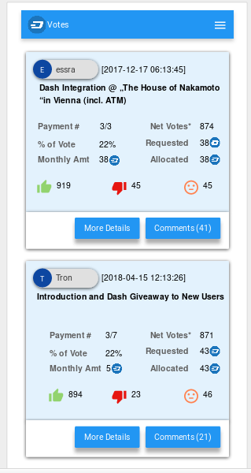
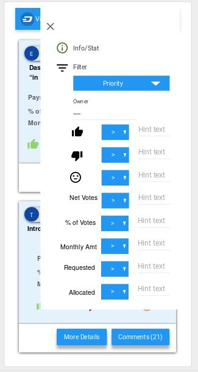
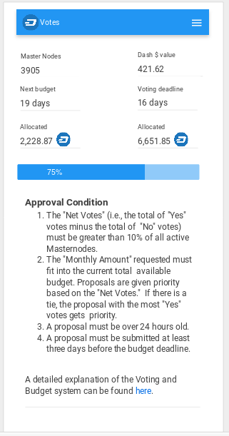
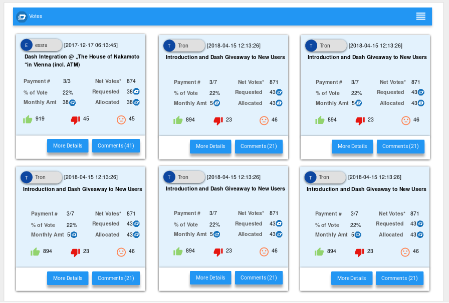

# Dash Votes

A proposal for www.dashvotes.com

## Background
Dashcentral.org APIs could be used provide better budget proposal voter interface.
The current dashvotertracker.com is not very user friendly. It does not have the ability to search or filter based 
on different criterias.
The website is also not mobile friendly.

## Proposal
I propose to improve the UI with some very useful features
- Allow complex search criterias for users to get to the data they are looking for
- Mobile friendly
- Open source so that anybody could contribute to it later
- Host from gh-pages and custom domain mapping to www.dashvotes.com

## Mock

### Mobile View
  
  - Search Screen
  
  
  
  - Filter Screen
  
  
  
  - Info/Stat Screen
  
  

### Desktop View

  - Search Screen
  
  
